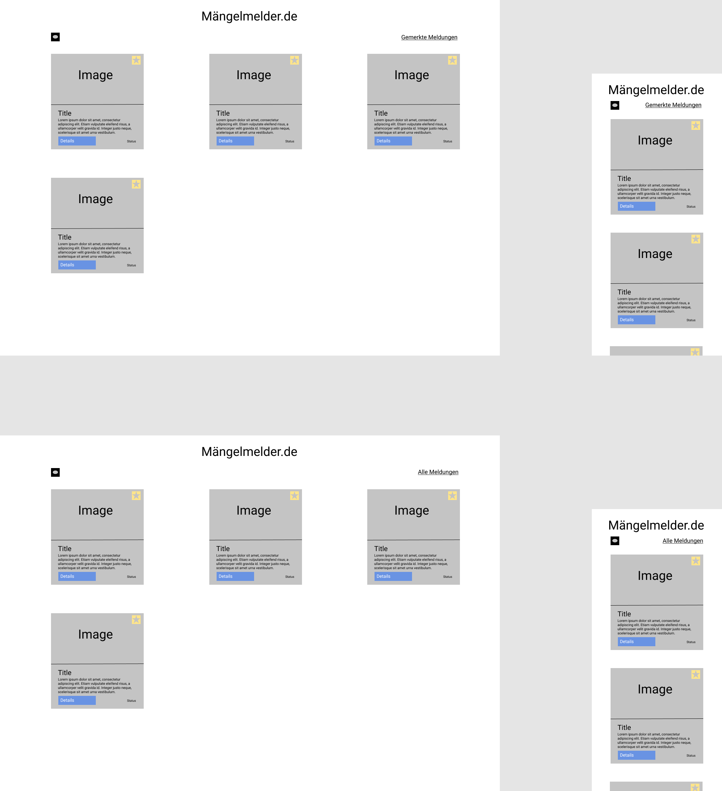

# Maengelmelder

DEMO: [Heroku](https://maengelmelder-de.herokuapp.com/)

# Table of Contents

- [Maengelmelder](#maengelmelder)
- [Table of Contents](#table-of-contents)
  - [Design Choices](#design-choices)
    - [Project Structure](#project-structure)
      - [Components](#components)
      - [Model](#model)
      - [Pages](#pages)
      - [Services](#services)
    - [Requirements](#requirements)
  - [Mockup](#mockup)
- [Development server](#development-server)
- [Running unit tests](#running-unit-tests)


## Design Choices


### Project Structure

```text
src/app/
├── components
├── models
├── pages
├── services
```

#### Components

The `components` folder contains reusable parts such as `ReportCardComponent`.

The `ReportCardComponent` implements the function to `save` reports, in which the user can naviagate to the `SavedReportsComponent` to inspect the list of saved reports. Additioanlly, the `ReportCardComponent` implements the `remove` function, which in return removes the report from `localStorage`.

#### Model

The `models` folder contains interfaces, which define structures such as reports.

#### Pages

The `pages` folder contains all components, which are navigatable as a page.

The project contains two pages, the `AllReportsComponent`-Page and the `SavedReportsComponent`-Page.

`AllReportsComponent` lists all reports retreived from the API. This component uses the `ReportCardComponent` to list each report.

`SavedReportsPage` lists only the saved reports by the uer. This component uses again `ReportCardComponent` to list saved reports.

#### Services

The `services` folder contains functionality such as communicating with the API or session management with `localStorage`. It contains two services, `StorageService` and `ReportService`.

### Requirements

1. >  Der Nutzer kann sich einzelne Meldungen mit einem Sternchen merken.

    `ReportCardComponent` contains a button, which calls a function in `StorageService` to save the report in `localStorage`.

    <sub> report-card.component.html:
    ```html
      <fa-icon (click)="saveReport()" ...></fa-icon>
    ```

2. > Gemerkte Meldungen werden in der Hauptliste angezeigt und in einem eigenen Bereich "Gemerkte Meldungen".

    "Gemerkte Meldungen" is represented by `SavedReportsComponent`. It only shows saved reports. The list with all reports (Hauptliste), is shown in `AllReportsComponent`.

3. > Gemerkte Meldungen bleiben über Browser Sessions hinweg bestehen.

    Session maangement is implemented by using `localStorage`. Saved reports are assigned to the key `savedReports`.

4. > Ein globaler "refresh" Button aktualisiert die Daten aller angezeigten Meldungen.

    The refresh button simply makes another GET request to the API.

    <sub> all-reports.component.html
    ```html
        <fa-icon (click)="refreshReports()" ...></fa-icon>
    ```

5. > Die Seite soll auch auf einem Mobiltelefon vernünftig aussehen.

    Responsivness is implemented with Bootstrap's Grid.

    ```html
    <div class="container pt-3">
        <div class="row">
            <div class="col-12 col-md-6 col-lg-3 mb-3">
                ...
            </div>
        </div>
    </div>
    ```

## Mockup

Mockup created with [Figma](https://www.figma.com/).

# Development server

This project was generated with [Angular CLI](https://github.com/angular/angular-cli) version 13.2.0.

Run `ng serve` for a dev server. Navigate to `http://localhost:4200/`. The app will automatically reload if you change any of the source files.

# Running unit tests

Run `ng test` to execute the unit tests via [Karma](https://karma-runner.github.io).